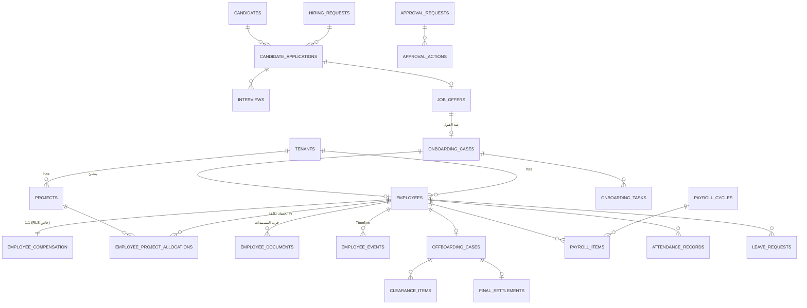

# 02 — نموذج البيانات (ERD + Schema)

كل الجداول تحمل الأعمدة القياسية التالية ولا تُكرر في التعريفات أدناه:
`id UUID PK` · `tenant_id UUID FK → tenants` · `created_at` · `updated_at` · `created_by UUID FK → users`، مع سياسة RLS موحدة على `tenant_id` (انظر [المعمارية](01-architecture.md)). الحذف Soft-delete عبر `archived_at` (Policy 14).

## ERD عالي المستوى

---

## 1) النواة والهيكل التنظيمي

### `tenants`
| العمود | النوع | ملاحظات |
|---|---|---|
| name_ar / name_en | text | اسم الشركة |
| slug | text unique | للنطاق الفرعي |
| plan, status | text | الاشتراك (Super Admin فقط) |
| settings | jsonb | صيغة HR Code، تقويم Payroll، أيام العمل، تنسيق الأرقام |

### `users`
ربط `auth.users` (Supabase Auth) بالـ Tenant والدور. `auth_user_id`، `employee_id FK nullable` (موظف ESS)، `roles text[]` (من الأدوار الـ 13)، `phone` (دخول OTP للعمالة الزرقاء)، `locale`.

### `departments` · `grades` · `job_titles` · `work_locations`
جداول مرجعية بسيطة: `name_ar/name_en`، `code`، (`job_titles.grade_id`، `work_locations.type` مكتب/موقع + إحداثيات Geofence للحضور).

### `projects`
| العمود | النوع | ملاحظات |
|---|---|---|
| code | text | **كود المشروع** — إلزامي في طلب التوظيف والـ Hiring Email |
| name_ar / name_en | text | |
| status | enum | active / on_hold / closed — إغلاق المشروع يطلق محفز "End of Project Assignment" |
| project_manager_id | FK employees | |
| location_id | FK work_locations | |

---

## 2) Core HR

### `employees` — السجل الرئيسي
| المجموعة | الأعمدة |
|---|---|
| الهوية | `hr_code` (فريد، يولَّد بصيغة الـ Tenant، **لا يُعاد استخدامه**)، `name_ar`، `name_en`، `national_id` (14 رقم، unique لكل tenant — منع التكرار وكشف الـ Rehire)، `birth_date`/`gender`/`governorate` (مستخرجة من الرقم القومي)، `mobile`، `personal_email`، `work_email`، `photo_path`، `address`، `marital_status`، `emergency_contact jsonb` |
| التوظيف | `job_title_id`، `grade_id`، `department_id`، `direct_manager_id FK employees`، `employment_type` (permanent/temporary/project)، `collar` (white/blue)، `hire_date`، `contract_signing_date`، `status` |
| التأمينات | `social_insurance_number`، `insurance_office`، `syndicate_card` (نقابة المهندسين) |
| الأعلام | `is_rehire`، `requires_medical_exam` (CM/PM Engineers & Riggers)، `safety_sensitive_role` |

**`status` (Status Engine):** `pending → active → suspended → offboarding → archived`
الانتقال إلى `active` محكوم بدالة `fn_can_activate(employee_id)` التي تتحقق من شروط التفعيل الستة (الدليل — Onboarding Stage 9): اكتمال المستندات، توقيع العقد، إتمام متطلبات HSE، الفحص الطبي، جاهزية الأنظمة، الشهادات المطلوبة. **لا يدخل أي موظف Payroll قبل Active** (Policy 1).

### `employee_compensation` — 1:1 مع الموظف، RLS مشدد (Payroll/HR Manager/Finance فقط — Policy 9)
`net_salary`، `gross_salary`، `insurable_salary`، `allowances jsonb` (بدلات ثابتة)، `bank_name`، `bank_account/iban`، `bank_verified boolean` + `bank_verified_by/at` (Policy 6)، `payment_method`.

### `employee_project_allocations`
`employee_id`، `project_id`، `allocation_pct` (مجموع تخصيصات الموظف النشطة = 100% — قيد Check بدالة)، `work_location_id`، `start_date`، `end_date`. أساس تقارير التكلفة بالمشروع (Policy 12).

### `document_types` + `employee_documents` — خزنة المستندات
`document_types` تُزرع (Seed) بالـ 13 مستنداً من الدليل + أنواع مخصصة لكل Tenant:

1. شهادة ميلاد كمبيوتر (أصل) 2. شهادة المؤهل (أصل) 3. شهادة الخدمة العسكرية (أصل) 4. نموذج 6 تأمينات أو برنت رسمي (صورة) 5. كعب عمل 6. فيش جنائي باسم الشركة 7. ست صور شخصية 8. صورتا بطاقة سارية 9. تقرير الفحص الطبي نموذج 111 10. صورتا كارنيه نقابة المهندسين (إن وجد) 11. شهادة قياس مستوى مهارة (فنيين) 12. ترخيص مزاولة مهنة (فنيين) 13. (قابل للإضافة حسب الـ Tenant)

أعمدة النوع: `name_ar/en`، `applies_to` (all/engineers/technicians)، `is_original` (أصل يُسترد عند الـ Offboarding)، `requires_expiry`.

`employee_documents`: `employee_id`، `document_type_id`، `file_path`، `status` (required/received/verified/expired)، `expiry_date`، `original_received boolean` + `received_by/at`، `original_returned_at` (يُملأ في Offboarding Stage 6)، `ai_classification jsonb` (مخرجات الـ Classifier/OCR قبل الاعتماد البشري).

### `employee_events` — الـ Timeline
سجل Append-only لكل تغيير: `employee_id`، `event_type` (hire/promotion/transfer/salary_change/penalty/contract_renewal/status_change/...)، `effective_date`، `payload jsonb` (قبل/بعد)، `attachment_path`، `approval_request_id FK`.

### `audit_log`
Trigger عام على الجداول الحساسة: `table_name`، `record_id`، `action`، `old_data/new_data jsonb`، `actor_id`، `at`. Append-only، مقسم شهرياً (Policy 16).

---

## 3) Recruitment

### `hiring_requests` — Stage 1 (كل الحقول الإلزامية من الدليل)
`position_title_id`، `vacancies_count`، `project_id` (يجلب الكود والاسم)، `direct_manager_id`، `location_id`، `salary_range_min/max` (مرئي لأدوار محددة)، `required_qualifications text`، `priority` (**P0/P1**)، `hiring_type` (new/replacement)، `replaced_employee_id FK employees` (إلزامي عند الإحلال — يتحقق النظام من الـ HR Code والاسم تلقائياً من Core HR)، `status` (draft/pending_approval/approved/sourcing/.../closed)، `approval_request_id`.

### `candidates` — الـ Talent Pool
`name_ar/en`، `national_id`، `mobile`، `email`، `cv_path`، `parsed_profile jsonb` (مخرجات CV Parser: خبرات، مهارات، شهادات)، `embedding vector` (pgvector — البحث الدلالي)، `expected_salary`، `availability`، `source` (إعلان/database/ترشيح)، `blacklisted boolean`.

### `candidate_applications` — مرشح × طلب
`candidate_id`، `hiring_request_id`، `stage` (screening/requester_review/assessment/final_selection/offer/hired/rejected)، `screening_notes` (نتيجة الفرز الهاتفي + توقع الراتب + الجاهزية)، `requester_decision` + `rejection_reason`، `match_score` (AI %)، `rank`.

### `interviews` + `interview_evaluations`
`interviews`: `application_id`، `type` (**technical / hse / hr**)، `scheduled_at`، `interviewer_id`، `status`، `calendar_event_id`.
`interview_evaluations`: نموذج تقييم رقمي لكل نوع — `scores jsonb` (لـ HR: التواصل، الملاءمة الثقافية، الجاهزية، التوقعات المالية — من الدليل Stage 4)، `recommendation` (pass/fail/hold)، `comments`.

### `job_offers`
`application_id`، `offer_letter_path` (مولّد من قالب)، `net_salary`، `allowances jsonb`، `document_requirements`، `training_requirements`، `sent_at`، `acceptance_token` (رابط قبول/رفض إلكتروني)، `expires_at` (**sent_at + 30 يوماً** — Stage 7)، `status` (draft/sent/accepted/rejected/expired)، `confirmed_joining_date`.

---

## 4) Onboarding

### `onboarding_cases`
`job_offer_id` أو إدخال مباشر، `employee_id FK` (يُنشأ السجل في Stage 2)، `hiring_email jsonb` (**الحقول الـ 14 من الدليل**: الاسم عربي/إنجليزي، الرقم القومي، الموبايل، المسمى، كود المشروع، اسم المشروع، المدير المباشر، موقع العمل، الراتب الصافي، البدلات والمزايا، رقم التأمين الاجتماعي، تاريخ توقيع العقد، تاريخ المباشرة — ويولَّد الإيميل منها تلقائياً)، `joining_date`، `priority` (P0/P1)، `status`، `activated_at`.

### `onboarding_tasks`
مولدة من قالب المراحل التسع: `case_id`، `stage` (1–9)، `task_key` (مثل contract_signed، si_form1، nda، handbook_ack، medical_insurance_reg، bank_letter، erp_profile، corporate_email، laptop، ppe، uniform، access_card، medical_exam، course_firefighting، course_first_aid، course_electrical، course_risk_assessment، course_heights، hr_orientation، hse_orientation، ops_induction، ...)، `owner_role` (Personnel/IT/HSE/Operations/TA)، `due_date` (من SLA المرحلة)، `status`، `completed_by/at`، `attachment_path`.

### `hse_records`
`employee_id`، `type` (medical_exam/safety_course)، `course_key`، `result` (fit/unfit/pass/fail)، `certificate_path`، `issued_at`، `expiry_date` (تغذي تنبيهات 60/30/7).

---

## 5) Offboarding

### `offboarding_cases`
`employee_id`، `trigger` (**resignation / contract_expiration / termination / end_of_project**)، `notice_date`، `last_working_day` (**قاعدة إلزامية: قطع كل Access في هذا اليوم كحد أقصى**)، `status`، `stage` (1–6)، `exit_interview jsonb` (الأسباب + الملاحظات — Stage 5).

### `clearance_items` — مصفوفة الـ Clearance من الدليل (Stage 4)
`case_id`، `department` (it/operations_admin/finance/direct_manager)، `item_key` (laptop_return، email_closure، hardware_recovery، id_card_return، medical_card_return، asset_return، advance_clearance، petty_cash_settlement، liability_verification، handover_approval)، `status`، `cleared_by/at`، `notes`.

### `handover_forms`
`case_id`، `to_employee_id`، `duties jsonb`، `continuity_plan`، `manager_approved_by/at`.

### `final_settlements` — Stage 5
`case_id`، `final_salary`، `unused_leave_balance` + `leave_compensation` (من موديول Leave)، `deductions jsonb`، `other_entitlements jsonb`، `si_form6_path` (نموذج 6 تأمينات)، `total`، `status`، `finance_approved_by/at` (Policy 13).

---

## 6) Payroll, Allowances & KPI

### `payroll_cycles`
`month`، `status` يتقدم وفق التقويم الإلزامي (Policy 2): `new_hires (يوم 18) → validation (18–19) → register_updated (18–19) → allocations_review (20–23) → adjustments (20–23) → processing (20–23) → submitted_to_finance (≤25) → paid (28–نهاية الشهر) → cost_reported (≤10 الشهر التالي)`، مع `deadline_at` لكل انتقال و`locked boolean`.

### `payroll_items`
`cycle_id`، `employee_id`، `gross/net`، `taxes`، `social_insurance`، `components jsonb` (تفصيلي)، `bank_snapshot jsonb` (لقطة الحساب المتحقق وقت الدفع)، `status`. **قيد:** لا يُدرج موظف غير `active` (Policy 1) أو غير `bank_verified` (Policy 6).

### `payroll_adjustments`
`cycle_id`، `employee_id`، `type` (medical_deduction/insurance_update/advance/loan_deduction/reimbursement/correction)، `amount`، `supporting_doc_path` (**إلزامي** — Policy 4)، `approval_request_id` (**إلزامي** — Policy 7). تصحيحات ما بعد المعالجة تمر من هنا أيضاً موثقة (Policy 11).

### `advances_loans`
`employee_id`، `type`، `principal`، `installment`، `balance`، `approval_request_id` — يغذي استقطاعات الدورة ويُسوّى في الـ Offboarding.

### `allowance_cycles` + `allowance_items`
دورة شهرية (طلب من المشاريع 10–15 → إعداد 10–15 → تحقق 15–17 → تسليم للمالية ≤17 → دفع 20–25 → تقرير تكلفة ≤10): `project_id`، `employee_id`، `allowance_type`، `amount`، `eligibility_checked`، `status`.

### `kpi_cycles` + `kpi_evaluations` + `kpi_items`
ربع سنوية: `kpi_evaluations` (من PMO — `employee_id`، `scores jsonb`، `approved`) → `kpi_items` (حساب المكافأة، التحقق، التسليم للمالية، الدفع، تقرير التكلفة بالمشروع).

### `cost_reports`
مولدة: `cycle_type` (payroll/allowance/kpi)، `cycle_id`، `project_id`، `breakdown jsonb` — التوزيع وفق `employee_project_allocations` (Policy 12).

---

## 7) Attendance & Leave

### `shifts` + `attendance_records`
`shifts`: تعريفات الورديات لكل موقع. `attendance_records` (**مقسم شهرياً**): `employee_id`، `date`، `check_in/out`، `method` (gps/site_supervisor/manual)، `location jsonb` (تحقق Geofence)، `overtime_minutes`، `status` (present/absent/leave/mission)، `exception_reason`.

### `leave_types` + `leave_balances` + `leave_requests`
`leave_types` تُزرع وفق قانون العمل المصري: سنوي (21 يوم، 30 لمن تجاوز 10 سنوات خدمة أو سن الخمسين)، عارضة (7 ضمن السنوي)، مرضي، وضع، حج، بدون أجر... `leave_balances`: رصيد سنوي لكل موظف/نوع (يغذي `final_settlements.unused_leave_balance`). `leave_requests`: طلب + `approval_request_id` + خصم تلقائي عند الاعتماد.

---

## 8) المحركات العرضية

### `approval_workflows` + `approval_steps` + `approval_requests` + `approval_actions`
محرك الاعتمادات القابل للتهيئة — التفاصيل في [05-approval-engine.md](05-approval-engine.md). أي كيان يطلب اعتماداً يحمل `approval_request_id`.

### `sla_definitions` + `sla_timers`
تعريفات الـ SLA لكل (موديول، مرحلة، أولوية) — مزروعة بأرقام الدليل حرفياً — وعدادات تعمل بساعات العمل. التفاصيل في [04-sla-engine.md](04-sla-engine.md).

### `notification_templates` + `notifications` + `scheduled_alerts`
قوالب مزدوجة اللغة متعددة القنوات + سجل الإرسال + التنبيهات الاستباقية (60/30/7 لانتهاء المستندات/العقود/الشهادات). التفاصيل في [موديول 09](modules/09-notifications.md).

---

## فهارس وأداء (الحد الأدنى)

- فهرس مركّب يبدأ بـ `tenant_id` على كل جدول: `(tenant_id, status)`، `(tenant_id, employee_id)`...
- `employees`: unique `(tenant_id, national_id)`، unique `(tenant_id, hr_code)`.
- `attendance_records` و `audit_log`: تقسيم شهري (Partitioning by range on date).
- `candidates.embedding`: فهرس HNSW (pgvector).
