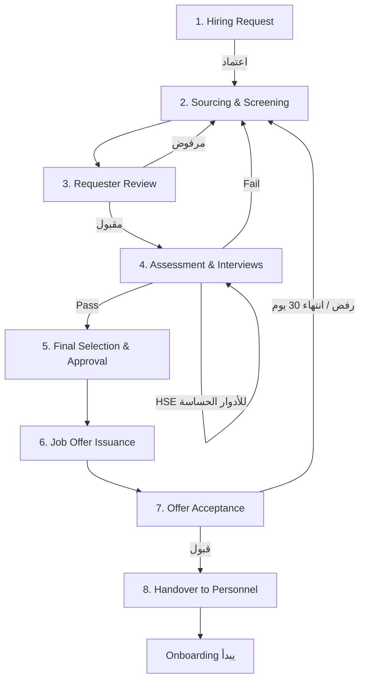

# الموديول 2: Recruitment (التوظيف — 8 مراحل)

> **المصدر:** Part I — Hiring Process Workflow من الدليل، مطابق حرفياً بمراحله الثمانية وSLAاته.

## الهدف

رقمنة دورة التوظيف الكاملة من الدليل مع قياس SLA لكل مرحلة بنظام P0/P1.

## سير العمل (مطابق للدليل)

### Stage 1 — Hiring Request (المسؤول: الطالب — PM/مدير القسم)
نموذج إلكتروني بكل الحقول الإلزامية من الدليل، لا يُرسل ناقصاً:
المسمى الوظيفي، عدد الشواغر، **كود المشروع واسمه**، المدير المباشر، الموقع (مكتب/موقع)، **نطاق الراتب المعتمد**، المؤهلات والمهارات والخبرة المطلوبة، **الأولوية (P0 حرج/فوري — P1 قياسي)**، نوع الطلب:
- **New Position**، أو
- **Replacement** — يستلزم **HR Code واسم الموظف المستقيل**، ويتحقق النظام منهما تلقائياً من Core HR (موجود؟ في حالة Offboarding/مؤرشف؟)

→ يدخل [مسار اعتماد](../05-approval-engine.md) → **Output:** طلب توظيف معتمد.

### Stage 2 — Sourcing & Screening (TA)
نشر الإعلان، بحث في بنك السير الذاتية (**Talent Pool** قابل للبحث الدلالي)، فرز السير، فرز هاتفي مع تسجيل النتيجة و**توقع الراتب** (يُقارن آلياً بالنطاق المعتمد) و**الجاهزية** → **Output:** قائمة مرشحين مختصرة.

### Stage 3 — Requester Review (الطالب)
المدير الطالب يستعرض بروفايلات المرشحين داخل النظام، يقبل/يرفض **مع سبب**، ويؤكد المقابلات → **Output:** قائمة مقابلات معتمدة.

### Stage 4 — Assessment & Interviews (الفني + HSE + TA)
جدولة المقابلات مع دعوات تقويم تلقائية، ونماذج تقييم رقمية لكل نوع:
- **Technical Interview:** تقييم الكفاءة الفنية
- **HSE Assessment:** للأدوار الحساسة أمنياً (Safety-Sensitive) فقط
- **HR Interview:** التواصل، الملاءمة الثقافية، الجاهزية، التوقعات المالية

→ **Output:** تقييم وتوصية المقابلات.

### Stage 5 — Final Selection & Approval (الطالب + الفني + TA)
شاشة **مقارنة المرشحين النهائيين** جنباً إلى جنب (التقييمات، الرواتب المتوقعة، الجاهزية، Match %) → اختيار نهائي → اعتمادات متسلسلة → **Output:** مرشح معتمد.

### Stage 6 — Job Offer Issuance (TA)
توليد خطاب العرض من قالب تلقائياً + إرساله بالإيميل مع **متطلبات المستندات** (الـ 13) و**متطلبات التدريب والشهادات** + رسالة رفض مهذبة لغير المختارين → **Output:** عرض عمل رسمي.

### Stage 7 — Offer Acceptance (المرشح)
رابط قبول/رفض إلكتروني (Token بلا تسجيل دخول) + تأكيد تاريخ المباشرة. **مهلة قصوى 30 يوماً تقويمياً — عداد تلقائي** بتنبيه قبل الانتهاء → **Output:** حالة انضمام مؤكدة.

### Stage 8 — Handover to Personnel (TA)
زر **"تسليم"** ينقل الملف كاملاً (الطلب، البروفايل، التقييمات، العرض، تاريخ المباشرة) لموديول [Onboarding](03-onboarding.md) ويولّد **الـ Hiring Email** تلقائياً بحقوله الـ 14 → **Output:** ملف توظيف مكتمل مُسلَّم + بدء الـ Onboarding. SLA: في تاريخ المباشرة.

## SLA Engine (من الدليل حرفياً)

| المرحلة | P0 | P1 |
|---|---|---|
| طلب التوظيف | نفس اليوم | نفس اليوم |
| الفرز والترشيح | 72 ساعة عمل | 5 أيام عمل* |
| مراجعة الطالب | يوم عمل | 72 ساعة |
| المقابلات | 3–5 أيام | 5–7 أيام |
| الاختيار النهائي | 24–48 ساعة | 2–3 أيام |
| إصدار العرض | 24–48 ساعة | 2–3 أيام |
| قبول العرض | 30 يوم كحد أقصى | 30 يوم |
| التسليم لـ Personnel | تاريخ المباشرة | تاريخ المباشرة |

\* الدليل به خطأ مطبعي (P1 = 5 ساعات) — صُحح منطقياً إلى 5 أيام عمل ويُراجع مع الإدارة. عدّاد لكل مرحلة، تلوين أخضر/أصفر/أحمر، تصعيد تلقائي عند التجاوز — التفاصيل في [محرك الـ SLA](../04-sla-engine.md).

## الشاشات

| الشاشة | لمن |
|---|---|
| نموذج طلب التوظيف + متابعة طلباتي | المدير الطالب |
| Pipeline Board (Kanban بالمراحل الثمانية + عدادات SLA) | TA |
| Talent Pool (بحث عادي + دلالي + فلاتر) | TA |
| مراجعة المرشحين (قبول/رفض بسبب) | المدير الطالب |
| جدولة المقابلات + نماذج التقييم الرقمية | المقيّمون |
| مقارنة المرشحين النهائيين | لجنة الاختيار |
| محرر العرض + حالة الإرسال والعداد | TA |
| صفحة قبول/رفض العرض العامة (موبايل أولاً، عربي/إنجليزي) | المرشح |
| تقارير التوظيف (Time-to-Hire، معدلات القبول، المصادر) | HR Manager |

## الأتمتة والذكاء الاصطناعي

- **CV Parsing:** رفع السيرة الذاتية → استخراج الاسم والخبرات والمهارات والشهادات تلقائياً وبناء بروفايل المرشح
- **AI Matching & Ranking:** ترتيب المرشحين حسب تطابقهم مع الطلب (المؤهل، سنوات الخبرة، الموقع، توقع الراتب ضمن النطاق) مع **Match %**
- **JD Generator:** توليد الوصف الوظيفي والإعلان من المسمى والمتطلبات (عربي/إنجليزي)
- **بحث دلالي في الـ Talent Pool:** "هات ميكانيكا باور خبرة 5 سنين اشتغل في محطات" → نتائج حتى لو الكلمات مختلفة (pgvector)
- **Interview Question Suggester:** اقتراح أسئلة فنية حسب الدور
- **أتمتة كاملة:** تذكير المقيّمين المتأخرين، إرسال الرفض المهذب تلقائياً، تنبيه قبل انتهاء مهلة الـ 30 يوماً
- **تحليلات:** Time-to-Hire فعلي مقابل SLA، معدلات قبول العروض، أفضل مصادر التوظيف
