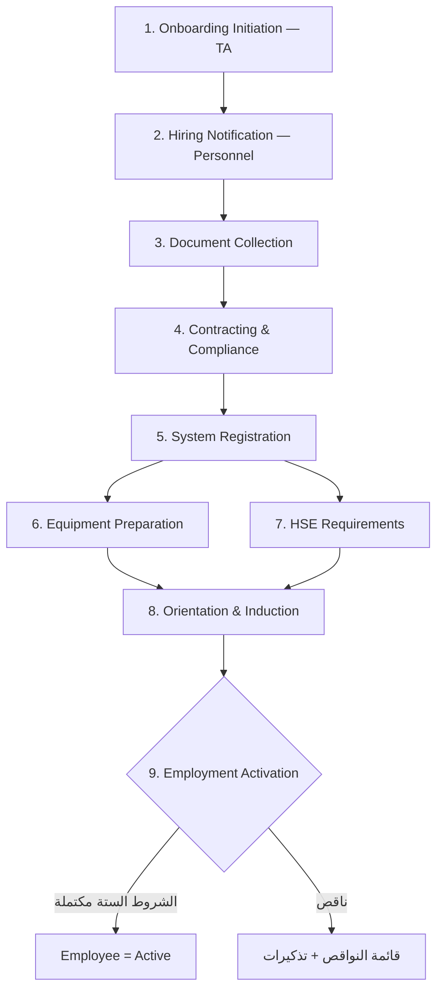

# الموديول 3: Onboarding (التهيئة — 9 مراحل)

> **المصدر:** Part II — Onboarding Process Workflow من الدليل، مطابق حرفياً بمراحله التسع.

## الهدف

من قبول العرض حتى **تفعيل الموظف بالكامل** في الأنظمة والـ Payroll والمشاريع — مع ضمان الجاهزية التشغيلية والالتزام القانوني. كل مرحلة قائمة مهام (Tasks) بمالك ومهلة، والتفعيل بوابة (Gate) لا تُفتح إلا باكتمال الشروط الستة.

## سير العمل (مطابق للدليل)

### Stage 1 — Onboarding Initiation (TA) — SLA: تاريخ المباشرة
إصدار **الـ Hiring Email** المعتمد لـ Personnel والجهات المعنية + نموذج New Hire Onboarding + العرض المعتمد والمستندات + تأكيد تاريخ المباشرة + بدء التنسيق مع Personnel وIT وHSE وOperations وAdministration.

**الـ Hiring Email يتولد تلقائياً من بيانات الـ Handover ويشمل الحقول الـ 14 (من الدليل):**
1. الاسم بالإنجليزية 2. الاسم بالعربية 3. الرقم القومي 4. رقم الموبايل 5. المسمى الوظيفي 6. كود المشروع 7. اسم المشروع 8. المدير المباشر 9. موقع العمل 10. الراتب الصافي 11. البدلات والمزايا 12. رقم التأمين الاجتماعي 13. تاريخ توقيع العقد 14. تاريخ المباشرة

### Stage 2 — Hiring Notification & Personnel Initiation (Personnel) — SLA: تاريخ المباشرة
استلام الإيميل المعتمد → إصدار الـ Hiring Notification الرسمي → فتح سجل Onboarding (وهنا **يُنشأ سجل الموظف في Core HR بحالة Pending**) → تسجيله في الـ Tracker → تنسيق الأنشطة مع الأقسام.

### Stage 3 — Document Collection & Verification (Personnel) — SLA: تاريخ المباشرة
إرسال Checklist المستندات (الـ 13 — القائمة الكاملة في [Core HR](01-core-hr.md#document-vault--خزنة-المستندات)) → استلام وتحقق → إنشاء الملف الشخصي. الموظف يرفع مستنداته بنفسه من رابط/ESS والـ AI يصنفها ويطابقها بالـ Checklist.

### Stage 4 — Contracting & Compliance (Personnel) — SLA: تاريخ المباشرة
إعداد وتوقيع: **عقد العمل، نموذج تأمينات اجتماعية (1)، NDA (إن انطبق)، كتيب سياسات الشركة + إقرار استلام الـ Handbook** — وكلها تولَّد من قوالب. + تسجيل التأمين الطبي + **خطاب فتح حساب بنكي للراتب** + تسجيل الـ Payroll.

### Stage 5 — System Setup Registration (Personnel + TA) — SLA: تاريخ المباشرة
إنشاء البروفايل في النظام → **توليد HR Code** → تحديث السجلات → طلب إنشاء إيميل شركة من IT → طلب صلاحيات الأنظمة من IT (مهام تُسند لـ IT تلقائياً).

### Stage 6 — Equipment & Operational Preparation (IT + Operations + Admin) — SLA: P0 = 1–2 يوم عمل، P1 = 3–5 أيام
تخصيص العهدة حسب الدور: لابتوب، موبايل وباقة، أدوات PPE، يونيفورم، كارت دخول، أدوات أخرى — كل عنصر مهمة بمالك، وتسجَّل كعهدة على الموظف (أساس الـ Clearance لاحقاً).

### Stage 7 — HSE Requirements (HSE) — SLA: P0 = 10–15 يوم عمل، P1 = 20–25 يوم
- **الفحص الطبي إلزامي لـ:** مهندسي CM/PM وريجرز CM/PM (يُعلَّم الموظف `requires_medical_exam` تلقائياً من المسمى)
- **كورسات السلامة حسب الدور:** Fire Fighting، First Aid، Electrical Safety، Risk Assessment، Working at Heights

→ **Output:** Medical & Courses Clearance — تسجَّل في `hse_records` بشهادات وتواريخ انتهاء (تغذي تنبيهات 60/30/7).

### Stage 8 — Orientation & Induction (HR + HSE + Operations) — SLA: P0 = 7–10 أيام عمل، P1 = 20–25 يوم
- **HR Orientation:** السياسات، المزايا، Code of Conduct، إجراءات HR
- **HSE Orientation:** متطلبات السلامة، إجراءات الطوارئ، لوائح الموقع
- **Operational Induction:** متطلبات المشروع، خطوط التقارير، إجراءات الموقع

### Stage 9 — Employment Activation (HR) — SLA: P0 = 7–10 أيام عمل، P1 = 20–25 يوم (الوظائف المساندة: نفس اليوم)
**بوابة التفعيل — الشروط الستة من الدليل، يتحقق منها النظام آلياً:**
1. ✅ المستندات مكتملة 2. ✅ العقود موقعة 3. ✅ متطلبات HSE مكتملة 4. ✅ الفحص الطبي (Clearance) 5. ✅ الأنظمة جاهزة 6. ✅ الشهادات المطلوبة مستلمة

اكتمالها → زر "تفعيل" → `employees.status = Active` → يدخل الموظف الـ Payroll (Policy 1) وتُغلق الحالة. أي نقص → قائمة نواقص واضحة بمالك كل عنصر + تذكيرات تلقائية.

## الشاشات

| الشاشة | لمن |
|---|---|
| Onboarding Tracker (كل الحالات المفتوحة × المراحل، ألوان SLA) | Personnel / HR Manager |
| بطاقة حالة Onboarding (Checklist المراحل التسع بمهامها) | Personnel |
| مهامّي (مهام Onboarding المسندة لقسمي) | IT / HSE / Operations / Admin |
| بوابة رفع المستندات الذاتية (موبايل، عربي مبسط) | الموظف الجديد |
| شاشة بوابة التفعيل (الشروط الستة بحالاتها) | HR |

## الأتمتة والذكاء الاصطناعي

- توليد الـ Hiring Email والعقد والنماذج من قوالب تلقائياً
- توليد كل مهام المراحل التسع تلقائياً من قالب عند فتح الحالة، بمواعيد محسوبة من SLA
- تصنيف المستندات المرفوعة وOCR ومطابقة الـ Checklist آلياً
- إسناد الفحص الطبي وكورسات السلامة تلقائياً حسب المسمى/الدور
- تذكيرات تلقائية لأصحاب المهام المتأخرة + تصعيد (محرك SLA)
- إشعار WhatsApp للموظف الجديد بكل خطوة مطلوبة منه

## السياسات المنفذة

Policy 1 (لا Payroll قبل التفعيل — بوابة التفعيل هي نقطة الدخول الوحيدة) · Policy 16 (كل مهمة موثقة بمنفذها وتوقيتها).
