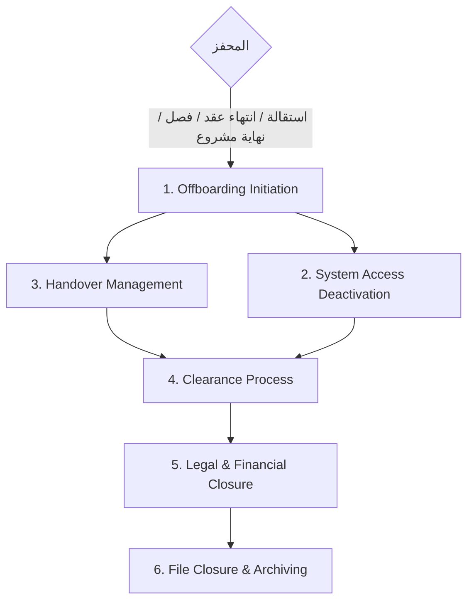

# الموديول 4: Offboarding (إنهاء الخدمة — 6 مراحل)

> **المصدر:** Part III — Offboarding Process Workflow من الدليل، مطابق حرفياً بمراحله الست.

## الهدف

خروج منضبط يحمي أصول الشركة، يضمن استمرارية العمل، ويغلق الالتزامات القانونية والمالية — مع أرشفة الملف (لا حذف أبداً).

## سير العمل (مطابق للدليل)

### Stage 1 — Offboarding Initiation (Personnel) — SLA: حسب سبب الخروج
**المحفزات الأربعة (من الدليل):** الاستقالة · انتهاء العقد · الفصل (Termination) · انتهاء التكليف بالمشروع (End of Project Assignment).
فتح حالة رسمية بتحديد `last_working_day`، وتتحول حالة الموظف إلى `Offboarding`.
- الاستقالة يمكن أن تُقدَّم من ESS مباشرة
- انتهاء العقد ونهاية المشروع **يكتشفهما النظام تلقائياً** (تواريخ العقود وحالة المشروع) ويقترح فتح الحالة

### Stage 2 — System Access Deactivation (Personnel + IT) — SLA: يوم الخروج
تحديث حالة الموظف في النظام (وفي Nama7 ERP لدى العميل المرجعي) → تعطيل الصلاحيات → إغلاق الحسابات.
> **قاعدة إلزامية (نص الدليل):** كل الـ Access يُعطَّل بحد أقصى **آخر يوم عمل للموظف** — النظام ينشئ مهمة IT بتاريخ استحقاق = آخر يوم عمل، وتصعيد فوري إن لم تُغلق.

### Stage 3 — Knowledge & Task Handover (الموظف + المدير المباشر) — SLA: حسب سبب الخروج
نموذج Handover رقمي: المهام الجارية، المسؤوليات المنقولة ولمن، خطة الاستمرارية → **اعتماد المدير المباشر** شرط لإغلاق المرحلة.

### Stage 4 — Clearance Process — SLA: يوم الخروج
مصفوفة إخلاء طرف رقمية، كل قسم يُعلّم بنوده (من الدليل):

| القسم | البنود |
|---|---|
| **IT** | إرجاع اللابتوب · إغلاق الإيميل · استرداد الأجهزة |
| **Operations / HR & Administration** | إرجاع كارت الدخول (ID) · إرجاع كارت التأمين الطبي · إرجاع العهدة |
| **Finance** | تسوية السلف · تسوية العهدة النقدية (Petty Cash) · التحقق من الالتزامات |
| **المدير المباشر** | اعتماد الـ Handover |

→ **Output:** نموذج إخلاء طرف معتمد — لا تُصرف التسوية النهائية قبله.

### Stage 5 — Legal & Financial Closure (HR) — SLA: يوم الخروج
- **Exit Interview:** جمع الملاحظات وتوثيق أسباب الترك (تغذي تحليلات الاحتفاظ بالموظفين)
- **الإغلاق القانوني:** **نموذج تأمينات اجتماعية (6)** + الالتزام بقانون العمل
- **التسوية النهائية — حساب:** الراتب الأخير + **رصيد الإجازات غير المستخدم** (من موديول [Leave](07-leave.md)) − الاستقطاعات + مستحقات أخرى → اعتماد Finance قبل الصرف (Policy 13)

### Stage 6 — File Closure & Archiving (Personnel) — SLA: يوم الخروج
**إرجاع المستندات الأصلية** للموظف (المعلَّمة "أصل مستلم" في خزنة المستندات) → **إقرار استلام موقَّع** → تحديث السجلات → أرشفة الملف وفق سياسات الاحتفاظ → إغلاق السجل (`status = Archived` — الـ HR Code لا يُعاد استخدامه، والملف يبقى للـ Rehire Detection).

## الشاشات

| الشاشة | لمن |
|---|---|
| Offboarding Tracker (الحالات المفتوحة × المراحل + عدادات يوم الخروج) | Personnel |
| بطاقة حالة الخروج (Stepper بالمراحل الست) | Personnel / HR |
| مصفوفة الـ Clearance (بنود قسمي) | IT / Ops / Finance / المدير |
| نموذج الـ Handover + الاعتماد | الموظف / المدير |
| Exit Interview رقمي | HR |
| شاشة التسوية النهائية (الحساب + الاعتمادات) | Payroll / Finance |
| تقديم استقالة | ESS |

## الأتمتة والذكاء الاصطناعي

- اكتشاف تلقائي لانتهاء العقود ونهاية المشاريع → اقتراح فتح حالات
- توليد مهام الـ Clearance تلقائياً من العهدة **الفعلية** المسجلة على الموظف (لا قائمة عامة)
- حساب التسوية النهائية آلياً (راتب + رصيد إجازات × أجر اليوم − سلف وقروض من `advances_loans`)
- حجب صرف التسوية حتى اكتمال الـ Clearance واعتماد Finance — قيد نظام
- تحليل أسباب الترك من الـ Exit Interviews (تجميع AI للأنماط: قسم، مدير، مشروع، سبب)
- تنبيه يومي تصعيدي لأي Access لم يُقطع بعد آخر يوم عمل

## السياسات المنفذة

Policy 13 (اعتماد Finance قبل الصرف) · Policy 14 (أرشفة واحتفاظ، لا حذف) · Policy 16 (Audit) + القاعدة الإلزامية لقطع الـ Access.
